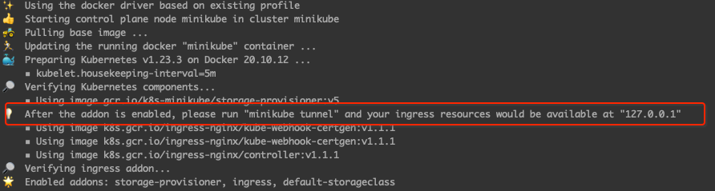

# Deploy In Minikube
Run following steps to deploy _stock-aggregator_ service on minikube locally 
1. Create config map `kubectl create -f stock-agg-cm.yml`
2. Create secrets after replacing the placeholder in the `stock-agg-secret.yml` with base64 encoded API Key 
   1. Alternatively, create secret from CLI `kubectl create secret generic api-key --from-literal=API_KEY=<KEY_VALUE>`
3. Deploy by running `kubectl create -f stock-agg-dep.yml`
4. Deploy Service `kubectl create -f stock-agg-svc.yml`
5. Open a separate terminal and run `minikube addons enable ingress`to enable ingress controller
6. Create Ingress using `kubectl create -f stock-agg-ingress.yml`
7. In the other terminal run `minikube tunnel`
   1. This would need sudo permissions to map port 80
      

# Test
In a browser open 127.0.0.1 or the localhost address and this should pull up the response from the stock-aggregator service. Alternatively,
`curl -v 127.0.0.1:80` should return something like this:
```dtd
{
   "metadata":{
      "days":7,
      "average_closing_price":7.721428571428571,
      "stock":"SUMO",
      "created_time":"2022-05-30",
      "request_id":"afb85505-17ca-49f8-bfc8-b66f2eaa8268"
   },
   "daily":[
      {
         "1. open":"8.0800",
         "2. high":"8.6750",
         "3. low":"8.0600",
         "4. close":"8.4900",
         "5. volume":"2056461",
         "date":"2022-05-27"
      },
      {
         "1. open":"7.4100",
         "2. high":"7.7850",
         "3. low":"7.3600",
         "4. close":"7.7100",
         "5. volume":"1200851",
         "date":"2022-05-26"
      },
      {
         "1. open":"7.1700",
         "2. high":"7.6300",
         "3. low":"7.1700",
         "4. close":"7.5400",
         "5. volume":"860294",
         "date":"2022-05-25"
      },
      {
         "1. open":"7.5300",
         "2. high":"7.5300",
         "3. low":"7.1100",
         "4. close":"7.2600",
         "5. volume":"962946",
         "date":"2022-05-24"
      },
      {
         "1. open":"7.6800",
         "2. high":"7.7600",
         "3. low":"7.3700",
         "4. close":"7.6600",
         "5. volume":"1124770",
         "date":"2022-05-23"
      },
      {
         "1. open":"7.8900",
         "2. high":"7.9490",
         "3. low":"7.3800",
         "4. close":"7.7000",
         "5. volume":"1139953",
         "date":"2022-05-20"
      },
      {
         "1. open":"7.6400",
         "2. high":"8.0600",
         "3. low":"7.6000",
         "4. close":"7.6900",
         "5. volume":"1097779",
         "date":"2022-05-19"
      }
   ]
}
```
